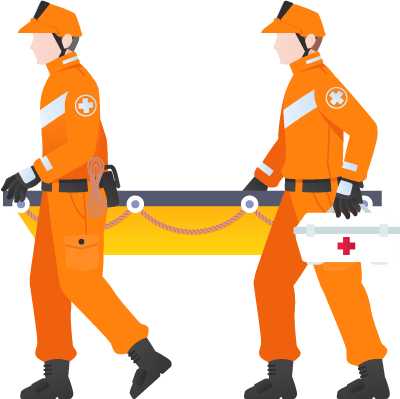

# Connectory Hackathon: EMMA - data is the new oil

In this challenge you shall develop a solution which helps authorities to direct rescue teams in case of earthquakes by using and displaying data from various sources in our Lego city.

## Disclaimer
Please take care not to publish sensitive information in this repository!
All content you publish here will fall under [Apache 2 License](https://www.apache.org/licenses/LICENSE-2.0).

## Useful Resources

* [Bosch IoT Things Documentation](https://things.eu-1.bosch-iot-suite.com/dokuwiki/doku.php?id=start)
* [Bosch IoT Permissions Documentation](https://permissions.s-apps.de1.bosch-iot-cloud.com/docs/specification/index.html)
* [Bosch IoT Development Guidelines](https://inside-docupedia.bosch.com/confluence/x/VSC6Hw) (internal link)
* [Bosch IoT Cloud Documentation](https://inside-docupedia.bosch.com/confluence/x/WzzZEw) (internal link)

## Hardware-Specific Documentation
* [Bosch XDK](https://www.bosch-connectivity.com/products/cross-domain/cross-domain-developement-kit/)
* [Bosch CISS](https://www.bosch-connectivity.com/products/industry-4-0/connected-industrial-sensor-solution/)
* [Bosch Thermotechnology Device API](https://developer.bosch.com/web/bosch-thermotechnology-device-api)
* [Pycom](https://pycom.io/)

[Medical vector created by freepik - www.freepik.com](https://www.freepik.com/free-photos-vectors/medical)